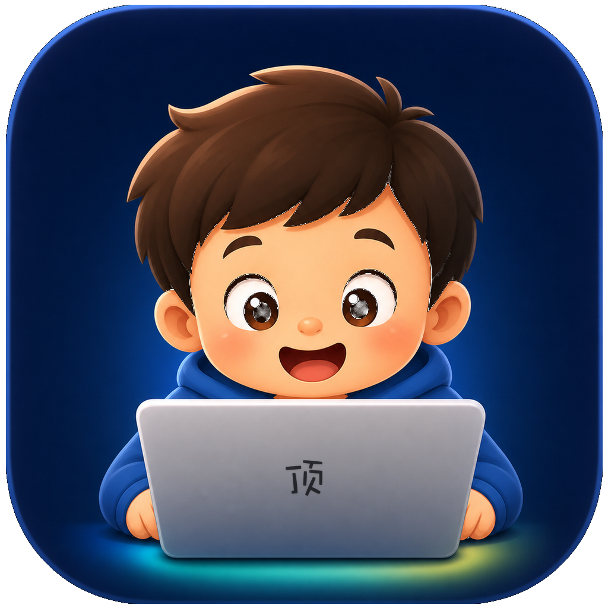
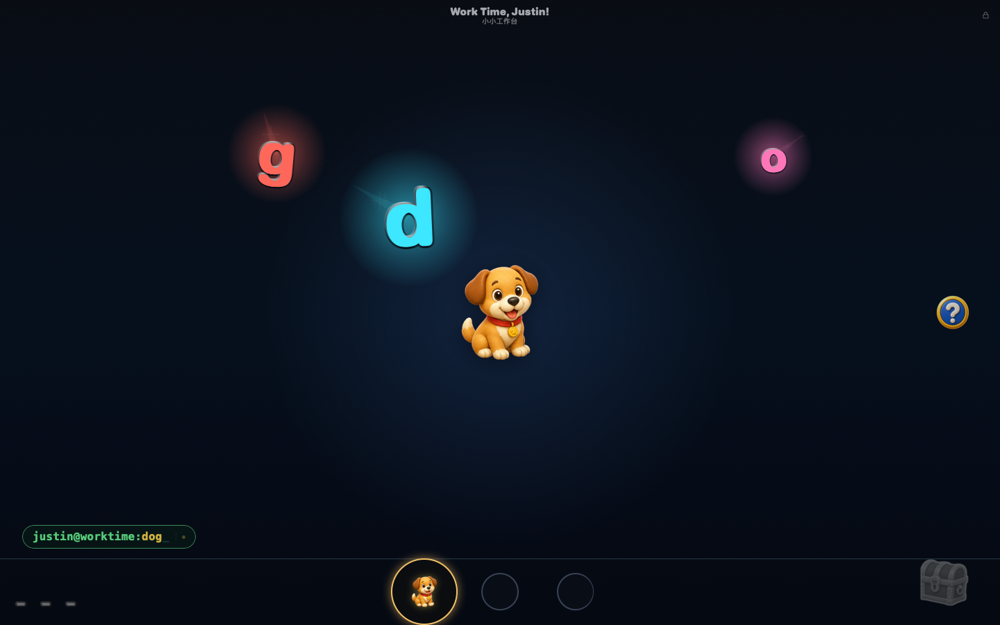
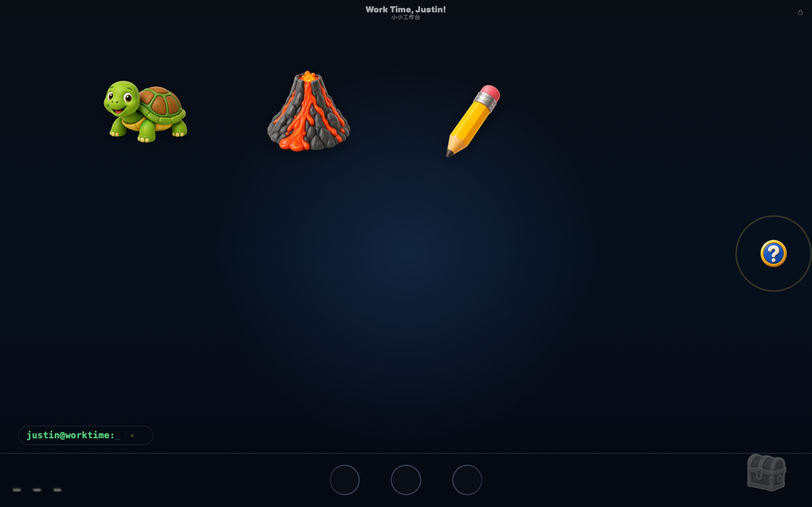

<p align="center">
  
</p>

<h1 align="center">WorkTime Justin / 小小工作台</h1>

<p align="center">
  <a href="#中文">中文</a> · <a href="#english">English</a>
</p>

<p align="center">
  
  
  
  
</p>

## 中文

WorkTime Justin / 小小工作台是给3岁儿子 Justin 的旧 MacBook 做的全屏 macOS 小应用。它来自一个很具体的场景：Justin 看到爸爸妈妈在工作，也打开自己的旧电脑，说自己也要“工作”。

这个应用把键盘乱按、鼠标乱点、找贴纸、拼单词、听声音和小奖励变成一个安全、可重复玩的“工作台”。它不是标准教育软件，更像一个给小朋友模仿大人工作的可爱桌面玩具。

### 运行效果





### 当前版本

当前发布版本：`1.0.0`

- macOS 11+ 通用应用：`x86_64` + `arm64`
- 本地构建产物：`app/dist/WorkTimeJustin.app`
- DMG 产物：`app/dist/WorkTimeJustin.dmg`
- 真机验收目标：Justin 的旧 Intel MacBook Air，macOS Big Sur

### 构建和运行

构建应用：

```bash
./app/build.sh
```

打开本地构建：

```bash
open app/dist/WorkTimeJustin.app
```

开发机使用项目目录下的 `app/dist/WorkTimeJustin.app`，不要把开发副本放在 `/Applications`。Justin 的机器上使用正式安装路径 `/Applications/WorkTimeJustin.app`。

### 项目结构

- `app/`：macOS 外壳和内嵌 Web 运行时
- `docs/index.html`：需求和素材验收 artifact
- `docs/design-review.html`：设计和媒体预览 artifact
- `docs/design-notes/`：设计、文案和素材草稿
- `tests/`：可复用测试和验收资产
- `.agents/docs/`：多 agent 协作协议

父母控制和本地安全边界见 `app/SECURITY.md`。

## English

WorkTime Justin is a fullscreen macOS app for Justin's old MacBook. It started from one concrete moment: Justin saw his parents working, opened his own old computer, and said he wanted to "work" too.

The app turns keyboard exploration, pointer play, sticker finding, secret words, sounds, and small rewards into a safe toddler workbench. It is not a conventional learning app; it is a playful desktop toy for copying the feeling of grown-up work.

### Screenshots


### Release

Current release: `1.0.0`

- macOS 11+ universal app: `x86_64` + `arm64`
- Local build output: `app/dist/WorkTimeJustin.app`
- DMG output: `app/dist/WorkTimeJustin.dmg`
- Stakeholder validation target: Justin's old Intel MacBook Air on macOS Big Sur

### Build And Run

Build the app:

```bash
./app/build.sh
```

Open the local build:

```bash
open app/dist/WorkTimeJustin.app
```

For the development machine, use the project build under `app/dist/`. Do not keep a development copy in `/Applications`. For Justin's machine, install the release app as `/Applications/WorkTimeJustin.app`.

### Project Layout

- `app/`: macOS app shell and bundled web runtime
- `docs/index.html`: requirements and asset validation artifact
- `docs/design-review.html`: design and media review artifact
- `docs/design-notes/`: design, copy, and asset drafts
- `tests/`: reusable checks and validation assets
- `.agents/docs/`: multi-agent collaboration protocol

Parent controls and local security notes are documented in `app/SECURITY.md`.
